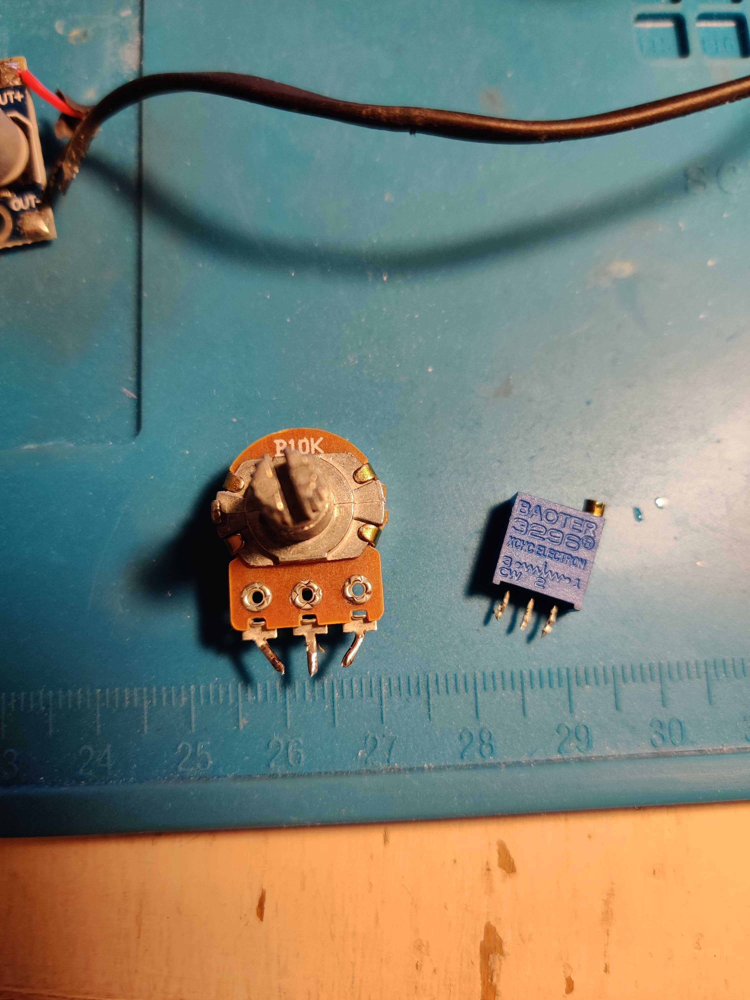
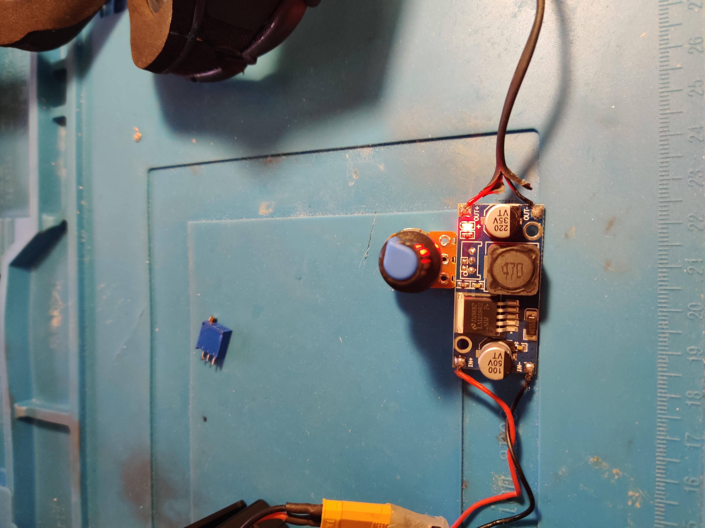

# airsoft-antifog-glasses
Instructions pour construire des lunettes d'airsoft sans buée

[English version here](README_EN.md)

## Propos

Cet assemblage est basé sur une copie chinoise des lunettes Oakley SI ballistic

## A savoir

Il est important de bien prendre ce modele exacte de lunettes, ou l'original.

## Liste des pièces

- [Copie chinoise Oakley SI ballistic](https://a.aliexpress.com/_EyxQSQt) (avec un ventilateur inclus)
or
- [Copie chinoise Oakley SI ballistic avec support casque](https://a.aliexpress.com/_EycWlfP) (sans ventilateur)
- 1 * [Buck converter](https://a.aliexpress.com/_EGvoNsp)
- 1 * [potentiometre 5k](https://a.aliexpress.com/_Exazmhr)
- 1 ou 2 [petit ventilateur de 21mm](https://a.aliexpress.com/_EwjtQF7) (suivant les lunettes achetées)
- Fils electrique pour ventilateurs et circuit
- 1 * connecteur externe pour batterie (ex: XT30)
- batterie 2S (7.4V)  (Lipo/Lion....)

## Outils requis

- Fer à souder
- Imprimante 3D printer pour les pièces
- Colle chaude

## Pièces imprimées

- 1 or 2 * [support ventilateur](printed_parts/Support%20ventilateur%20lunettes%20v66.stl) (1 ou 2 suivant les lunettes achetées)
- 1 * [boite de regulateur](printed_parts/boite%20r%C3%A9gulateur%20v14.stl)

## Instructions de montage

- Imprimer les pièces nécessaires 
- Retirez le potentiomètre bleu pour le circuit du convertisseur abaisseur 
- Plier les pieds extérieurs du potentiomètre vers la jambe centrale 
 
- Souder le potentiomètre 5k à la place du potentiomètre bleu 
- Couper les fils électriques à la longueur et les souder aux ventilateurs 
- Souder les deux ventilateurs à la sortie du circuit abaisseur 
- Pour un bon débit, faites en sorte qu'un ventilateur tire de l'air et que l'autre le pousse. Changer le côté du ventilateur dans le support pourrait ne pas produire un bon résultat.
- Souder le fil d'entrée au convertisseur abaisseur
 
- Mettre les fans en soutien aux fans 
- Prise en charge du ventilateur sur les lunettes 
- Acheminer les fils proprement à l'intérieur des googles (retirez l'écran pour le faire) 
- Testez l'assemblage avec une batterie, afin que tout fonctionne comme prévu 
- Mettez le circuit de convertisseur abaisseur dans le boîtier (fermer avec de la superglue)